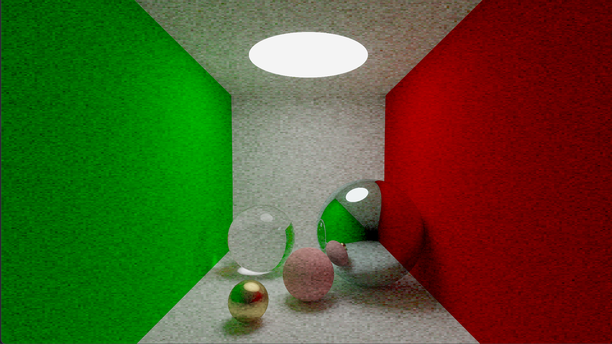

# Simple Ray Tracing

# prerequisites
- visual studio
- cuda
- cmake
# build instruction
~~~
cmake -B build
cmake --build build
~~~
and then you can find main.exe in build/Release or build/Debug
# reference
https://raytracing.github.io/

https://www.bilibili.com/video/BV1XL4y1q7Tp/?spm_id_from=333.999.0.0&vd_source=c69d1656111c5eccf75abd2700f3beb0